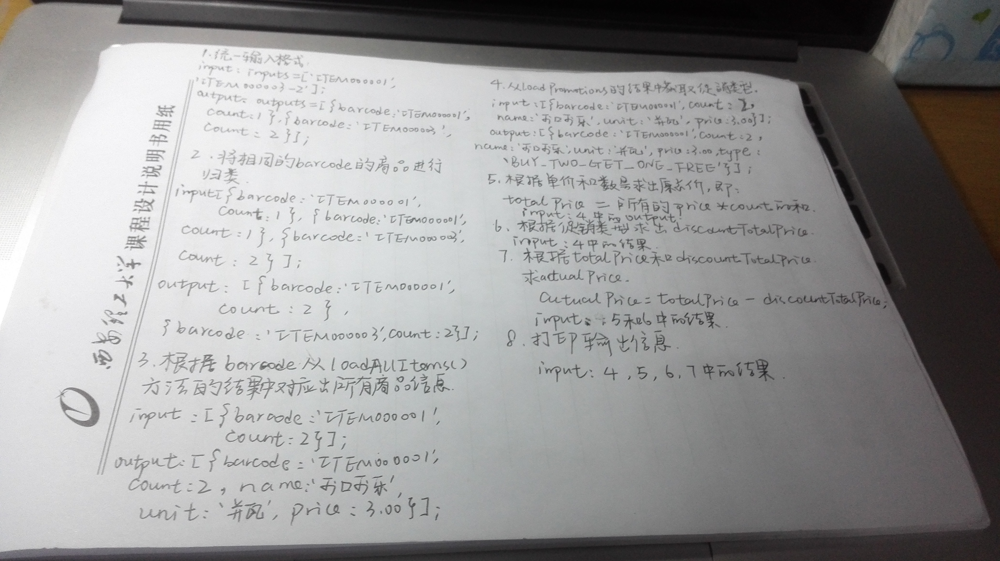

#POS机作业要求：
###整个过程分为5~10步：
1. 每一步包含描述，输入，输出
2. 描述只有一句话，例如：（正确）将学生成绩转换为等级    （错误）将数字转换成字符串
3. 输入输出要有非常明确的格式，例如：input: inputs = [{barcode: '',count:''}];   output: simpleItem = [{barcode:'',count:'',name:'',unit:''}];
4. 以上步骤需要写到一张纸上，且不能有涂改痕迹
5. 拍照后上传到github

###作业图片
 